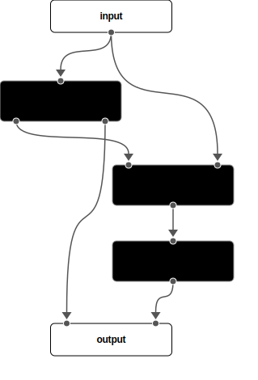
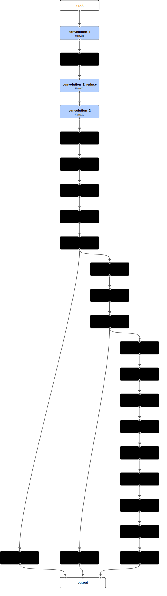

# Model Composer

## Overview

The goal of the project is to explore a different approach to define the full architecture of a neural network, for best communicating the core ideas to readers of the code. 

To this end, the `ModelComposer` class is designed along with a specific `yaml` format to allow parsing and building neural networks from a single or a suite of `yaml` files that can be housed in a well-defined directory structure. The accompanying [Neural Network Architecture Visualizer](https://network-visualizer-36300.web.app/) is designed to visualize the architecture of the neural network defined in the `yaml` file. 

The detailed documentation of the `yaml` format, `ModelComposer` class, and the visualizer can be found in the following mkdocs documentation: <br/>
[https://model-composer.readthedocs.io/en/latest/](https://model-composer.readthedocs.io/en/latest/).

## `yaml` Format
The `yaml` format is designed to achieve the following goals:
1. Human readability
2. Store not only the build configuration of the modules, but also how the modules are ***connected*** to each other.
3. It can be used to build the entire neural network.
4. It can be used in a visualization tool to visualize the architecture of the neural network.

Briefly, the `yaml` format that defines the architecture includes the following components:
- **name**: The name of the neural network.
- **modules**: Modules that are used to build the neural network. The module name is indicated by the key name.
    - **cls**: The actual class name of the module. It can be built-in PyTorch modules or custom modules.
    - **inp_src**: The input source of the module.
    - **config**: the build configuration of the module. 
    - **out_num**: The number of outputs of the module. Default to 1 if not specified.

The following shows the example toy model `yaml` file (same as [here](example/yaml/ToyExample/model.yaml)).
```yaml
name: toy_example
description: |
  A simple model showcasing the main idea of the YAML format for ComposableModel.
  It consists of two modules, each with a different number of 
  outputs. The first module has two outputs, and the second module has one 
  output. The final output is a combination of the outputs from both modules.
modules:
  input:
    - x

  module_1:
    cls: module_type_1
    inp_src:
      - x
    config:
      param1: 42
      param2: "42"
    out_num: 2

  module_2:
    cls: module_type_2
    inp_src:
      - module_1.0
      - x
    config: module_2.yaml
  
  module_3:
    cls: module_type_3
    inp_src:
      - module_2

  output:
    - module_1.1
    - module_3
```
The rendered architecture of the above `yaml` file is shown below using the [Neural Network Architecture Visualizer](https://network-visualizer-36300.web.app/):


See the [documentation](https://model-composer.readthedocs.io/en/latest/) for more details on the `yaml` format and the `ModelComposer` class.

## Build the Model

To build a model from the `yaml` file, you need to register any custom modules and then simply call the `ModelComposer` class with the parsed `yaml` file content. The following code snippet shows how to do this for the [GoogLeNet](example/yaml/GoogLeNet/) example provided in the `example` directory (see also the [notebook](example/notebooks/build_googlenet.ipynb)).

```python
import torch
from model_composer import read_config, ComposableModel, ModuleRegistry

# register custom modules
@ModuleRegistry.register("DepthConcat")
class DepthConcat(torch.nn.Module):
    """Concatenate the inputs along the specified dimension."""

    def __init__(self, dim=1):
        super().__init__()
        self.dim = dim

    def forward(self, *inputs):
        return torch.cat(inputs, dim=self.dim)


@ModuleRegistry.register("Conv2d")
class Conv2d(torch.nn.Module):
    """A simple wrapper around torch.nn.Conv2d."""

    def __init__(self, in_channels, out_channels, kernel_size, stride, padding):
        super().__init__()
        self.conv2d = torch.nn.Conv2d(
            in_channels, out_channels, kernel_size, stride, padding
        )
        self.bn = torch.nn.BatchNorm2d(out_channels)
        self.relu = torch.nn.ReLU()

    def forward(self, x):
        return self.relu(self.bn(self.conv2d(x)))

# Read the yaml file and build the model
cfg = read_config("example/yaml/GoogLeNet/model.yaml")
model = ComposableModel(**cfg)
```

The architecture of the GoogLeNet model is shown below using the [Neural Network Architecture Visualizer](https://network-visualizer-36300.web.app/):
